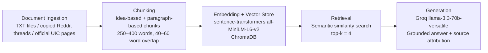

# Project 1 Planning: The Unofficial Guide

> Write this document before you write any pipeline code.
> Your spec and architecture diagram are what you'll use to direct AI tools (Claude, Copilot, etc.) to generate your implementation — the more specific they are, the more useful the generated code will be.
> Update the Retrieval Approach and Chunking Strategy sections if you change your approach during implementation.
> Update this file before starting any stretch features.

---

## Domain

My domain is student-generated knowledge about off-campus housing near UIC. This knowledge is hard to find through official channels because university pages list available resources and policies, but they do not capture the real-world advice students share about rent, roommates, neighborhood tradeoffs, commute time, safety, and which apartment-search methods actually work.

This information is also scattered across Reddit threads, listing sites, and informal discussion posts instead of being organized in one place.[web:43][web:39] This project will build a RAG system that makes this unofficial housing knowledge searchable and grounded so students can quickly get practical answers from real student experiences and official UIC context.

---

## Documents

| # | Source | Description | URL or location |
|---|--------|-------------|-----------------|
| 1 | r/uichicago – “Off-campus housing for students?” | Student discussion about cheap student-friendly housing, roommate ideas, rent expectations, and recommended housing platforms.| https://www.reddit.com/r/uichicago/comments/1lv4v9f/offcampus_housing_for_students/ |
| 2 | r/uichicago – “Advice on where to look for housing” | Student advice about where to search, commute concerns, and how overwhelming the UIC housing page can feel. | https://www.reddit.com/r/uichicago/comments/1shvf6e/advice_on_where_to_look_for_housing/ |
| 3 | r/uichicago – “Off campus housing website” | Student discussion about what the UIC off-campus housing website is actually used for and who can use it. | https://www.reddit.com/r/uichicago/comments/1s3ue96/off_campus_housing_website/ |
| 4 | r/uichicago – “Housing in college” | Student apartment-search advice with practical budget and neighborhood guidance. | https://www.reddit.com/r/uichicago/comments/1cz4ivj/housing_in_college/ |
| 5 | r/uichicago – “What’s the best way to find an apartment near UIC?” | Student discussion about apartment-hunting strategies and challenges finding units near campus. | https://www.reddit.com/r/uichicago/comments/c1k2ho/whats_the_best_way_to_find_an_apartment_near_uic/ |
| 6 | r/uichicago – “Need Help Finding Apartments” | Student discussion recommending areas between East and West campus and mentioning University Rentals.| https://www.reddit.com/r/uichicago/comments/1be96mp/need_help_finding_apartments/ |
| 7 | UIC Off-Campus Housing | Official listing service for rental units intended for UIC students, faculty, and staff.| https://offcampushousing.uic.edu |
| 8 | UIC CSRC Off-Campus Housing page | Official guidance on apartment searching and dealing with landlord or roommate issues.| https://csrc.uic.edu/off-campus-housing/ |
| 9 | UIC Campus Housing page | Official campus housing context that helps contrast dorming with off-campus options.| https://housing.uic.edu |
| 10 | Tripalink UIC housing guide | Off-campus housing guide focused on search tips, safety, and avoiding common renting pitfalls. | https://tripalink.com/blog/top-5-uic-housing-tips-to-easily-save-money-and-stay-safe |
| 11 | University Rentals | Property listing source for apartments in UIC, Little Italy, and Rush-related neighborhoods. | https://university.rentals |
| 12 | uhomes UIC housing page | Structured apartment-listing page for housing options near UIC. | https://en.uhomes.com/us/chicago/university-of-illinois-chicago-uic |

---

## Chunking Strategy

**Chunk size:**  
I will use chunks of about **250–400 words** for longer official pages and guide-style documents. For short Reddit posts or individual comments, I will keep each self-contained idea as its own chunk when possible instead of forcing a large fixed-size split.

**Overlap:**  
I will use an overlap of **40–60 words** between adjacent chunks for longer documents. For already short student posts or comment-sized text, I will use little or no overlap if the chunk already stands on its own.

**Reasoning:**  
My corpus is mixed: some sources are short, opinion-based student posts, while others are longer official or guide-style housing pages.Smaller, idea-based chunks work better for Reddit advice because one comment often contains one complete recommendation, such as where to search, how much rent to expect, or what sites to avoid.Slightly larger paragraph-group chunks make more sense for official pages because those pages explain resources, definitions, or procedures across multiple sentences and need more context to stay meaningful.

If chunks are too small, retrieval may return fragments like “Facebook has scams” without the explanation or safer alternatives. If chunks are too large, retrieval may combine unrelated details like apartment search strategy, roommate issues, and official policy into one diluted chunk that is harder to match precisely.The overlap helps preserve meaning when one useful idea spans two neighboring paragraphs, such as a neighborhood recommendation followed by cost or commute context.

---

## Retrieval Approach

**Embedding model:**  
I will use **`all-MiniLM-L6-v2` via sentence-transformers** because it is free, runs locally, and is a strong baseline for semantic search in a student RAG project.

**Top-k:**  
I will start with **top-k = 4** retrieved chunks per query. If responses seem incomplete, I may test top-k = 5, but I want to avoid retrieving too many loosely related chunks that make generation less grounded.

**Production tradeoff reflection:**  
For this project, `all-MiniLM-L6-v2` is a practical choice because it avoids API costs and rate limits while still enabling semantic retrieval over noisy student advice and official housing text.If I were deploying this for real users and cost was not a constraint, I would compare stronger embedding models based on accuracy on short opinion-based text, ability to handle slang or inconsistent terminology, multilingual support, latency, and whether the model must run locally or through an API. I would also care more about how well the model distinguishes subtle differences between neighborhoods, pricing advice, and official resource descriptions, since those details matter in housing decisions.

---

## Evaluation Plan

| # | Question | Expected answer |
|---|----------|-----------------|
| 1 | What platforms do students recommend for finding off-campus housing near UIC? | Students recommend using sites such as Domu, Apartments.com, Zillow, University Rentals, and the UIC off-campus housing website; some threads also mention Facebook or group-based searches, though Facebook may be described as scam-prone. |
| 2 | What rent range do students mention for sharing housing near UIC or in nearby neighborhoods like Little Italy? | Students describe shared housing as more realistic when splitting rent with roommates, and some advice places affordable shared options roughly around the high-hundreds-per-person range rather than fully solo cheap units near campus.|
| 3 | What warnings do students give about using Facebook for housing searches? | Some students warn that Facebook housing searches can include fraudulent or scam listings and recommend more reputable listing platforms instead. |
| 4 | What is the official purpose of the UIC off-campus housing website? | The UIC off-campus housing website is a listing service for rental units meant for UIC students, faculty, and staff.|
| 5 | What kinds of off-campus support does UIC’s CSRC page say it provides? | UIC’s CSRC page says it provides resources for apartment searching and for handling issues with landlords or roommates. |

---

## Anticipated Challenges

1. **Noisy and inconsistent documents.** My corpus includes Reddit threads, official UIC pages, and apartment-listing websites, so the structure, tone, and reliability of the text will vary a lot.Reddit posts may include informal language and conflicting advice, while listing sites may contain promotional language rather than neutral descriptions.

2. **Chunks that are either too short or too broad.** Some student comments are very short and may lose meaning if split mechanically, while long official pages may become too diluted if large sections are embedded together. I will need to inspect chunks carefully to make sure each one is readable, self-contained, and useful for retrieval.

3. **Off-topic retrieval or weak retrieval.** Because housing questions can overlap across topics like rent, safety, roommates, and neighborhoods, semantic search may retrieve partially relevant chunks that mention similar words but do not answer the actual question.

4. **Grounding and citation failures.** The generation step may produce plausible but unsupported advice from the language model’s general knowledge unless I use a strict prompt and attach source metadata programmatically.

---

## Architecture

---

## AI Tool Plan

**Milestone 3 — Ingestion and chunking:**  
I will use ChatGPT or Claude to help implement a script that loads copied Reddit threads and housing pages from local files, cleans boilerplate text, and chunks the documents according to my strategy. I will provide the AI with my **Documents** section, **Chunking Strategy** section, and **Architecture** diagram, and I will ask it to generate an ingestion script and a `chunk_text()` function that preserve source metadata. I expect the AI to produce code that handles mixed source formats and creates readable chunks. I will verify the output by printing cleaned documents and 5 representative chunks to ensure they are self-contained and match my planned chunk size and overlap.

**Milestone 4 — Embedding and retrieval:**  
I will use ChatGPT, Claude, or Copilot to implement embedding and retrieval with `sentence-transformers` and ChromaDB. I will provide the AI with my **Retrieval Approach** section and **Architecture** diagram, and I will ask it to generate code that embeds all chunks, stores them with source metadata, and retrieves the top 4 most relevant chunks for a user query. I expect scripts such as `build_index.py` and a retrieval function like `retrieve(query)`. I will verify the code by testing at least 3 evaluation questions and checking whether the returned chunks are actually relevant and from the correct source.

**Milestone 5 — Generation and interface:**  
I will use ChatGPT or Claude to help connect retrieval to a grounded generation pipeline using Groq’s `llama-3.3-70b-versatile` and to build a simple Gradio interface. I will provide the AI with my **Retrieval Approach**, **Evaluation Plan**, and the requirement that the answer must use only retrieved context and include source attribution. I expect the AI to generate a `query.py` or `app.py` file that retrieves chunks, builds a strict grounding prompt, calls the language model, and displays the answer with sources. I will verify the result by testing both in-scope and out-of-scope questions and checking that unsupported questions are refused instead of answered with hallucinated information.
